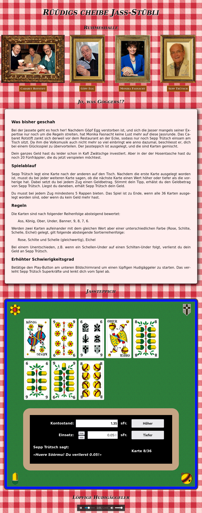

# Jassete [in Arbeit]

Bei der _Jassete_ geht es etwas hoch her. Nachdem Göpf Egg verstorben ist, und
sich die Jasser mangels seiner Expertise nur noch um die Regeln streiten, hat
auch Monika Fasnacht keine Lust mehr auf diese Jassrunde. Das Cabaret Rotstift
zankt sich derweil vor dem Restaurant an der Ecke, sodass nur noch Sepp Trütsch
einsam am Tisch sitzt. Da ihm die Volksmusik auch nicht mehr so viel einbringt,
beschliesst er, dich bei einem Glücksspiel zu übervorteilen. Der Jassteppich ist
ausgelegt und die Karten gemischt.

## Spielregeln

Jetzt legt der Sepp eine Karte nach der anderen auf den Tisch. Nachdem die erste
Karte ausgelegt worden ist, musst du bei jeder weiteren Karte sagen, ob die
nächste Karte einen Wert _höher_ oder _tiefer_ als die vorherige hat. Dabei
setzt du bei jedem Zug einen Geldbetrag. Stimmt dein Tipp, erhälst du den
Geldbetrag von Sepp Trütsch. Liegst du daneben, erhält Sepp Trütsch dein Geld.

Die Karten sind nach folgender Reihenfolge _absteigend_ bewertet:

1. Ass
2. König
3. Ober
4. Under
5. 10 (Banner)
6. 9
7. 8
6. 7
7. 6

Werden zwei Karten aufeinander mit dem _gleichen Wert_ aber einer
_unterschiedlichen Farbe_ (Rose, Schlite, Schelle, Eichel) gelegt, gilt folgende
_absteigende_ Sortierreihenfolge:

1. Rose
2. Schilte und Schelle (gleichwertig)
3. Eichel

Bei einem _Unentschieden_, z.B. wenn ein Schellen-Under auf einen Schilten-Under
folgt, erhälst du dein Geld zurück. Sepp Trütsch geht leer aus.

### Hardcore Mode

Betätige den _Play_-Button am unteren Bildschirmrand um einen _lüpfigen
Hudigäggeler_ zu starten. Das verleiht Sepp Trütsch Superkräfte und lenkt dich
vom Spiel ab.
